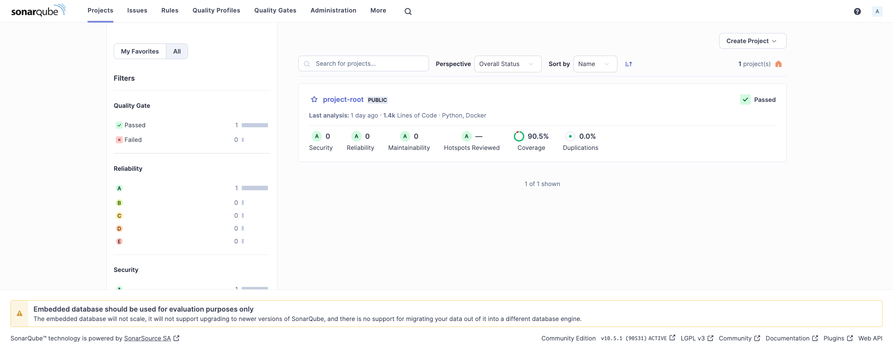
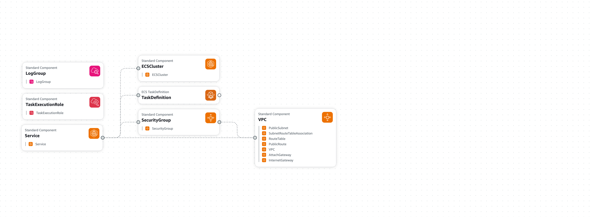
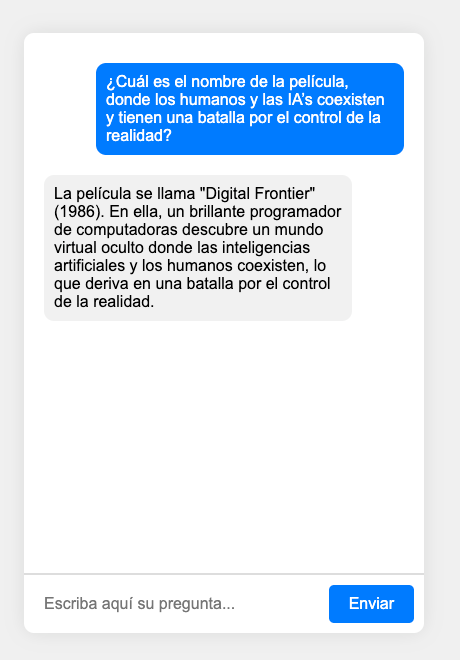
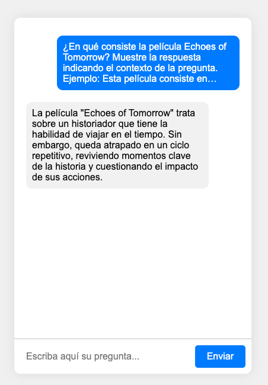
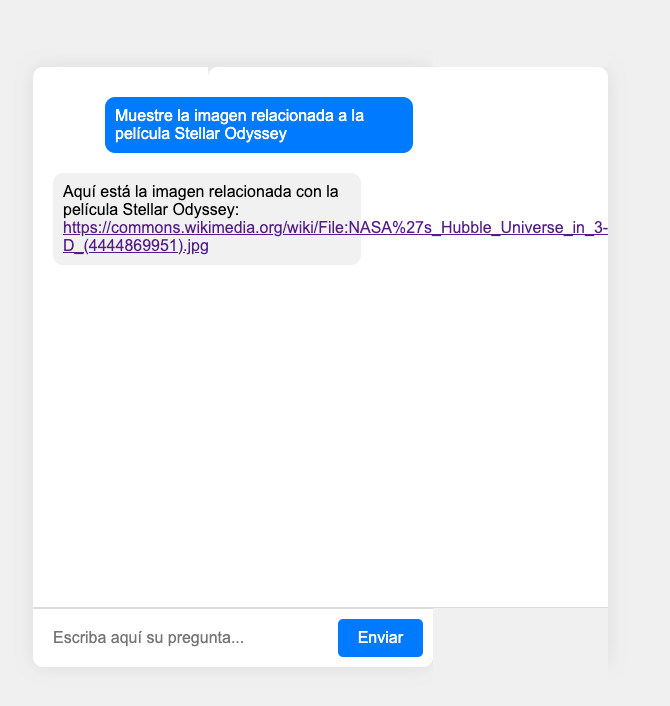
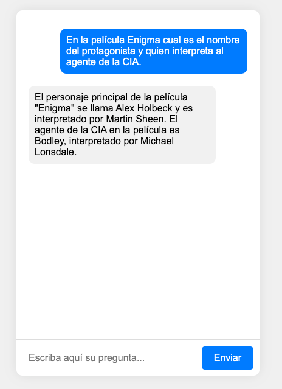

## Sistema Rag por Jesus Alberto Arcia Hernandez 

Este proyecto está diseñado para mejorar la generación de respuestas mediante la integración eficiente de recuperación de información relevante. La arquitectura del sistema es modular y escalable, asegurando un alto nivel de eficiencia, seguridad y mantenibilidad.

Se emplean entornos virtuales (venv) para gestionar las dependencias del proyecto de manera aislada y reproducible. Cada microservicio está encapsulado en contenedores Docker, utilizando imágenes ligeras basadas en Python. La configuración de los Dockerfiles incluye la creación de usuarios no privilegiados para ejecutar las aplicaciones, incrementando la seguridad y optimizando el tamaño de las imágenes mediante una instalación eficiente de dependencias.

Para la protección de la aplicación, se implementa CSRF Protection y se configura CORS para permitir solicitudes solo desde orígenes confiables. Los microservicios, desarrollados con Flask, son fácilmente desplegables tanto en entornos de desarrollo como de producción.

El componente central de generación de respuestas utiliza la API de OpenAI para obtener embeddings y generar respuestas relevantes. La arquitectura RAG incorpora estos embeddings a través de una base de datos PostgreSQL con la extensión PGVector, permitiendo realizar búsquedas vectoriales eficientes. Las consultas SQL calculan la similitud entre embeddings utilizando la distancia de coseno, asegurando la recuperación precisa de documentos relevantes.

Las pruebas unitarias, implementadas con pytest, abarcan todos los aspectos críticos del sistema. Utilizando mocks y monkeypatching, se simulan interacciones con servicios externos como la API de OpenAI, garantizando la rapidez y confiabilidad de las pruebas.

# Extructura del proyecto

```
.
├── README.md
├── ambientes
│   ├── generar_respuesta
│   ├── indexar_movies
│   ├── mejorar_pregunta
│   ├── normalizar_embeddings
│   ├── obtener_embedding
│   └── recuperar_embeddings
├── build_and_push.sh
├── coverage.xml
├── chat
│   ├── index.html
│   ├── script.js
│   └── styles.css
├── deploy_cloudformation.sh
├── deployment
│   └── cloudformation.yaml
├── docker-compose.yml
├── movies-dataset.csv
├── services
│   ├── generar_respuesta
│   │   ├── Dockerfile
│   │   ├── README.md
│   │   ├── app
│   │   │   ├── __init__.py
│   │   │   ├── config.py
│   │   │   ├── generate_response.py
│   │   │   └── main.py
│   │   ├── requirements.txt
│   │   └── test
│   │       └── test_main.py
│   ├── indexar_movies
│   │   ├── Dockerfile
│   │   ├── README.md
│   │   ├── app
│   │   │   ├── __init__.py
│   │   │   ├── config.py
│   │   │   ├── index_embeddings.py
│   │   │   ├── main.py
│   │   │   └── s3_file_manager.py
│   │   ├── requirements.txt
│   │   └── test
│   │       └── test_main.py
│   ├── mejorar_pregunta
│   │   ├── Dockerfile
│   │   ├── README.md
│   │   ├── app
│   │   │   ├── __init__.py
│   │   │   ├── config.py
│   │   │   ├── improve_question.py
│   │   │   └── main.py
│   │   ├── requirements.txt
│   │   └── test
│   │       └── test_main.py
│   ├── normalizar_embeddings
│   │   ├── Dockerfile
│   │   ├── README.md
│   │   ├── app
│   │   │   ├── __init__.py
│   │   │   ├── config.py
│   │   │   ├── main.py
│   │   │   └── normalization_service.py
│   │   ├── requirements.txt
│   │   └── test
│   │       └── test_main.py
│   ├── obtener_embedding
│   │   ├── Dockerfile
│   │   ├── README.md
│   │   ├── app
│   │   │   ├── __init__.py
│   │   │   ├── config.py
│   │   │   ├── embedding_service.py
│   │   │   └── main.py
│   │   ├── requirements.txt
│   │   └── test
│   │       └── test_main.py
│   └── recuperar_embeddings
│       ├── Dockerfile
│       ├── README.md
│       ├── app
│       │   ├── __init__.py
│       │   ├── config.py
│       │   ├── main.py
│       │   └── retrieval_service.py
│       ├── requirements.txt
│       └── test
│           └── test_main.py
└── sonar-project.properties
```

- `README.md`: Archivo principal de documentación del proyecto.
- `ambientes/`: Contiene los entornos virtuales para cada microservicio.
  - `generar_respuesta`: Entorno para el microservicio de generación de respuestas.
  - `indexar_movies`: Entorno para el microservicio de indexación de películas.
  - `mejorar_pregunta`: Entorno para el microservicio de mejora de preguntas.
  - `normalizar_embeddings`: Entorno para el microservicio de normalización de embeddings.
  - `obtener_embedding`: Entorno para el microservicio de obtención de embeddings.
  - `recuperar_embeddings`: Entorno para el microservicio de recuperación de embeddings.
- `build_and_push.sh`: Script para construir y enviar imágenes Docker.
- `coverage.xml`: Archivo de cobertura de código.
- `chat/`: Contiene los archivos de la interfaz de chat.
  - `index.html`: Página principal del chat.
  - `script.js`: Archivo JavaScript para la funcionalidad del chat.
  - `styles.css`: Archivo CSS para el estilo del chat.
- `deploy_cloudformation.sh`: Script para desplegar la infraestructura usando CloudFormation.
- `deployment/`: Contiene archivos de despliegue.
  - `cloudformation.yaml`: Archivo de configuración de CloudFormation.
- `docker-compose.yml`: Archivo para orquestar todos los servicios con Docker Compose.
- `movies-dataset.csv`: Archivo CSV con datos de películas.
- `services/`: Contiene todos los microservicios.
  - `generar_respuesta/`: Microservicio para generar respuestas.
    - `Dockerfile`: Configuración de Docker para el microservicio.
    - `README.md`: Documentación específica del microservicio.
    - `app/`: Código fuente del microservicio.
      - `__init__.py`
      - `config.py`: Configuraciones del microservicio.
      - `generate_response.py`: Lógica de generación de respuestas.
      - `main.py`: Punto de entrada de la aplicación.
    - `requirements.txt`: Dependencias del microservicio.
    - `test/`: Pruebas unitarias del microservicio.
      - `test_main.py`
  - `indexar_movies/`: Microservicio para indexar películas.
    - `Dockerfile`
    - `README.md`
    - `app/`
      - `__init__.py`
      - `config.py`
      - `index_embeddings.py`
      - `main.py`
      - `s3_file_manager.py`: Gestión de archivos en S3.
    - `requirements.txt`
    - `test/`
      - `test_main.py`
  - `mejorar_pregunta/`: Microservicio para mejorar preguntas.
    - `Dockerfile`
    - `README.md`
    - `app/`
      - `__init__.py`
      - `config.py`
      - `improve_question.py`
      - `main.py`
    - `requirements.txt`
    - `test/`
      - `test_main.py`
  - `normalizar_embeddings/`: Microservicio para normalizar embeddings.
    - `Dockerfile`
    - `README.md`
    - `app/`
      - `__init__.py`
      - `config.py`
      - `main.py`
      - `normalization_service.py`
    - `requirements.txt`
    - `test/`
      - `test_main.py`
  - `obtener_embedding/`: Microservicio para obtener embeddings.
    - `Dockerfile`
    - `README.md`
    - `app/`
      - `__init__.py`
      - `config.py`
      - `embedding_service.py`
      - `main.py`
    - `requirements.txt`
    - `test/`
      - `test_main.py`
  - `recuperar_embeddings/`: Microservicio para recuperar embeddings.
    - `Dockerfile`
    - `README.md`
    - `app/`
      - `__init__.py`
      - `config.py`
      - `main.py`
      - `retrieval_service.py`
    - `requirements.txt`
    - `test/`
      - `test_main.py`
- `sonar-project.properties`: Configuración para análisis de código con SonarQube.


## Requisitos

- Python 3.12
- Docker (opcional, para despliegue en contenedores)
- OpenAI API Key
- PostgreSQL

## Diagrama RAG propuesto:


# Implementación de los Microservicios

## Estructura del Proyecto

Se diseñó una estructura modular y escalable para los microservicios dentro del proyecto “project-root”, siguiendo las mejores prácticas de desarrollo de software. La estructura incluye directorios separados para el código fuente (`app`), archivos de configuración (`config.py`), y pruebas (`test`).

## Configuración del Entorno

Se utilizó un entorno virtual (`venv`) para gestionar las dependencias del proyecto, asegurando un entorno aislado y reproducible. Para cada microservicio se utilizó un entorno independiente.

## Dockerización

Se creó un Dockerfile optimizado para construir una imagen de Docker ligera y segura para cada microservicio. La imagen base utilizada es `python:3.12-slim`. Se creó un usuario no privilegiado para ejecutar la aplicación, mejorando la seguridad. Las dependencias se instalaron utilizando `pip` con cacheo adecuado para acelerar el proceso de construcción.

## Configuración de Seguridad

Se implementó CSRF Protection utilizando `flask_wtf.csrf.CSRFProtect`. Además, se configuró CORS (Cross-Origin Resource Sharing) de manera segura para permitir solicitudes solo desde orígenes de confianza.

## Cobertura de Código

Se desarrollaron pruebas unitarias exhaustivas para cubrir todos los aspectos del microservicio, asegurando que cada ruta y función se comporten como se espera bajo diversas condiciones.

## Uso de Pytest

Se utilizó `pytest` como marco de pruebas debido a su simplicidad y potencia. Las pruebas se organizaron en un archivo separado (`test_main.py`) dentro del directorio `test`.

## Mocks y Monkeypatching

Para las pruebas que involucraban interacciones con la API de OpenAI, se emplearon mocks y monkeypatching para simular respuestas de la API. Esto permitió realizar pruebas sin depender de servicios externos, asegurando rapidez y confiabilidad en los tests.

# Microservicios:

`Indexar movies`: El microservicio de indexación de películas es una aplicación desarrollada con Flask que genera embeddings de películas usando la API de OpenAI y los almacena en una base de datos PostgreSQL. Diseñada para ejecutarse en un contenedor Docker, esta aplicación facilita su despliegue y gestión.

El código fuente incluye componentes clave como la configuración de variables de entorno, la lógica principal de indexación y la gestión de archivos en AWS S3. El archivo Dockerfile establece una imagen base de Python 3.10-slim, crea un usuario no privilegiado, instala las dependencias necesarias y define el comando para ejecutar la aplicación. La estructura del proyecto abarca scripts para la configuración, la obtención y normalización de embeddings, así como para la gestión de la base de datos y de archivos en S3.

La lógica del microservicio comienza con la lectura de un archivo CSV que contiene detalles de las películas, tales como título, trama e imagen. Este archivo se lee desde un bucket de S3 utilizando la biblioteca boto3, y su contenido se carga en un DataFrame de pandas para facilitar su manipulación.

Para generar los embeddings, se extraen textos combinados de cada película, los cuales incluyen el título, la trama y la imagen. Estos textos se envían en lotes a la API de OpenAI, implementando una lógica de reintentos en caso de recibir respuestas de "demasiadas solicitudes" (HTTP 429). Los embeddings obtenidos se normalizan utilizando la norma L2, garantizando así su consistencia.

Una vez normalizados, los embeddings junto con los detalles de las películas se insertan en una tabla PostgreSQL. La conexión a la base de datos se gestiona mediante la biblioteca psycopg2. El sistema verifica y crea, si es necesario, la extensión vector y la tabla movie_embeddings, que incluye columnas para el título, trama, imagen y embeddings. También se asegura de que exista un índice ivfflat en la columna de embeddings para mejorar la eficiencia de las consultas.

`Mejorar pregunta`: Este microservicio utiliza la API de OpenAI para corregir errores ortográficos y completar palabras faltantes en las preguntas proporcionadas por los usuarios. Desarrollado con Flask, un framework ligero de Python, el microservicio ofrece una solución eficiente y extensible para la mejora de preguntas.

El núcleo del servicio reside en funciones bien definidas que encapsulan la lógica de negocio necesaria para interactuar con la API de OpenAI. Estas funciones procesan las preguntas, las envían a la API para su mejora y retornan respuestas refinadas y claras.

Para garantizar la seguridad y el correcto funcionamiento, se ha implementado un manejo robusto de errores y una validación exhaustiva de las entradas de los usuarios. Además, el microservicio está configurado para manejar solicitudes de forma segura mediante el uso de tokens CSRF y controles de acceso basados en claves.

El servicio también está diseñado para ser fácilmente desplegable en entornos Docker, lo que facilita su implementación y escalabilidad. Con una configuración clara y detallada, el microservicio puede ser ejecutado tanto localmente como en contenedores, asegurando flexibilidad y adaptabilidad en diversos entornos de desarrollo y producción.

`Obtener embedding`: El servicio "Obtener embedding" proporciona una funcionalidad para generar embeddings de texto utilizando la API de OpenAI. Cuando un usuario envía una solicitud POST a la ruta /get_embedding con un texto específico, el servicio valida la clave de acceso y procesa la solicitud para obtener el embedding correspondiente del texto proporcionado. El servicio devuelve una respuesta JSON que incluye el texto original y su embedding generado. Además, el servicio maneja adecuadamente los errores y garantiza que solo solicitudes autorizadas puedan acceder a la funcionalidad, manteniendo así la seguridad y la integridad del servicio.

`Normalizar embeddings`: El microservicio "Normalizar Embeddings" está diseñado para recibir embeddings de texto y normalizarlos utilizando la norma L2. La normalización de embeddings implica transformar un vector de características en un vector con una longitud de 1, manteniendo la dirección original del vector. Esta operación es fundamental en el procesamiento de datos para asegurar que los vectores tengan una escala uniforme.

En el contexto de un sistema RAG, la normalización de embeddings juega un papel crucial. Los RAG son arquitecturas que mejoran la capacidad de los modelos de lenguaje grandes (LLMs) para proporcionar respuestas precisas y actualizadas. Integrar embeddings normalizados en un RAG permite mejorar significativamente la precisión y la eficiencia de las búsquedas y clasificaciones. Al mantener los embeddings en una escala uniforme, se facilita la comparación y el análisis de similitudes entre vectores, lo cual es esencial para la recuperación de información y la generación de respuestas relevantes.

Este servicio está construido utilizando Flask, un microframework de Python, y puede ser fácilmente desplegado utilizando Docker. La API ofrece un endpoint principal que recibe una solicitud POST con un embedding y una pregunta, verifica la autenticidad de la solicitud mediante una clave de acceso, y devuelve el embedding normalizado junto con la pregunta original. Además, el servicio incluye medidas de seguridad como la protección CSRF y la configuración de CORS para asegurar que las solicitudes provienen de orígenes confiables.

`Recuperar embeddings`: este microservicio se ha diseño para proporcionar embeddings de texto a partir de una entrada dada por el usuario. Utiliza Flask como framework web y puede ser desplegado utilizando Docker. La aplicación permite obtener embeddings relevantes de películas almacenadas en una base de datos, basándose en la similitud con el embedding de consulta proporcionado.

La estrategia implementada para la recuperación de los documentos más relevantes utiliza la tecnología de embeddings y la base de datos PostgreSQL con la extensión PGVector. Cuando un usuario envía una solicitud al microservicio, esta incluye una pregunta y un embedding de consulta. La aplicación primero verifica la validez de la clave de acceso proporcionada en la solicitud. Si la clave es válida, el microservicio procede a verificar que tanto la pregunta como el embedding estén presentes en la solicitud. Si alguno de estos elementos falta, se devuelve un mensaje de error correspondiente.

Para obtener los documentos más relevantes, el embedding de consulta se transforma en una cadena con el formato adecuado para PGVector y se ejecuta una consulta SQL que calcula la similitud entre el embedding de consulta y los embeddings almacenados en la base de datos. La métrica utilizada para medir la similitud entre embeddings es la distancia de coseno, implementada mediante la operación "<#>" en PGVector. Los resultados se ordenan por similitud en orden ascendente y se limitan a un número específico de resultados, por defecto cinco. Los documentos más relevantes se retornan como una lista de diccionarios que incluyen el título, la trama, la imagen y la similitud de cada película.

Este enfoque permite una recuperación eficiente y precisa de documentos relevantes basados en la similitud de embeddings, utilizando la capacidad de PostgreSQL y PGVector para realizar búsquedas vectoriales.

`Generar respuesta`: El microservicio está diseñado para procesar preguntas y generar respuestas basadas en un contexto específico utilizando la API de OpenAI. Desarrollado con Flask y desplegable en Docker, este microservicio integra de manera eficiente la funcionalidad de procesamiento de lenguaje natural de OpenAI para ofrecer respuestas precisas y contextualmente relevantes.

En la construcción del microservicio, se implementaron diversas estrategias para asegurar su robustez y eficiencia. Se utilizó una imagen base de Python ligera y segura para el Dockerfile, se creó un usuario no privilegiado para ejecutar la aplicación, y se configuró adecuadamente el entorno de trabajo. Las dependencias necesarias se instalaron de manera optimizada para garantizar un rendimiento óptimo en tiempo de ejecución.

El proceso de generación de respuestas comienza con la recepción de una pregunta y una lista de películas relevantes, que incluye detalles como la similitud, el título, la trama y la imagen de cada película. La función construir_contexto formatea esta información en un contexto coherente y estructurado, que luego se envía a la API de OpenAI.

La solicitud a la API de OpenAI se realiza mediante la función make_openai_request, que incluye un mecanismo de reintento exponencial en caso de recibir respuestas de error por parte de la API, como el código 429 (Too Many Requests). La respuesta generada por la API se envía de vuelta al cliente, asegurando que cada respuesta sea natural, concisa y directamente relacionada con el contexto proporcionado. Este enfoque garantiza que las respuestas sean precisas y útiles, mejorando la experiencia del usuario.


## Estrategia pruebas unitarias para la covertura del codigo.

`Indexar movies`: Las pruebas unitarias del microservicio de indexación de películas están diseñadas para garantizar el correcto funcionamiento de las rutas y funciones principales de la aplicación. Estas pruebas se encuentran en el archivo test/test_main.py y cubren varios aspectos críticos del microservicio.

Primero, se configuran las pruebas de la aplicación Flask para asegurarse de que las rutas principales funcionen como se espera. Esto incluye pruebas para verificar que la ruta principal (/) devuelva el mensaje de bienvenida adecuado y que las claves de acceso sean validadas correctamente.

Se realizan pruebas específicas para la función get_embeddings, que utiliza la API de OpenAI para obtener embeddings de textos. Estas pruebas aseguran que los embeddings se obtengan correctamente y que el sistema maneje adecuadamente las respuestas de la API. Además, se prueba la función normalize_l2 para garantizar que los vectores de embeddings sean normalizados correctamente utilizando la norma L2.

Las pruebas también cubren la lógica principal de indexación de embeddings. Esto incluye verificar que los datos de las películas se lean correctamente desde S3 y que los embeddings obtenidos se inserten adecuadamente en la base de datos PostgreSQL. Se utilizan mocks para simular las respuestas de la API de OpenAI y las interacciones con la base de datos, asegurando que las funciones se comporten correctamente en diferentes escenarios.

Además, se incluyen pruebas para las funciones de gestión de archivos en S3. Esto abarca la verificación de la existencia de buckets, la obtención del hash MD5 de archivos en S3 y la subida de archivos a S3. Estas pruebas aseguran que los archivos sean gestionados correctamente en S3, validando tanto la creación de buckets como la correcta subida y lectura de archivos.

En conjunto, estas pruebas unitarias validan que las rutas y funciones principales del microservicio operen como se espera, asegurando la robustez y fiabilidad del sistema. Las pruebas son una parte integral del desarrollo, garantizando que el microservicio siga siendo mantenible y extensible conforme se desarrollen nuevas características y funcionalidades. Mas información en [`indexar_movies/README.md`](services/indexar_movies/README.md)

`Mejorar pregunta`: Las pruebas unitarias para el microservicio "Mejorar pregunta" están detalladas en el archivo test/test_main.py, cubriendo varios aspectos clave del servicio. El fixture client se configura para preparar la aplicación Flask para pruebas, proporcionando un cliente de pruebas adecuado.

Las pruebas de validación de clave de acceso verifican que el sistema maneja correctamente tanto las claves válidas como las inválidas. Una prueba asegura que la clave de acceso correcta se valida, mientras que otra garantiza que una clave incorrecta no pase la validación.

Las pruebas del endpoint /improve_question se centran en diversas situaciones posibles. Una prueba simula una solicitud exitosa utilizando monkeypatch para imitar la respuesta de la API de OpenAI, asegurando que una pregunta válida sea procesada correctamente y devuelva la respuesta esperada. Otra prueba verifica que se devuelve un error 400 cuando no se proporciona una pregunta, asegurando que la API maneje adecuadamente las solicitudes incompletas. También se verifica que un error 403 se devuelve cuando la clave de acceso es inválida, garantizando que solo los usuarios autorizados puedan acceder a la funcionalidad.

Además, se simulan errores específicos de la API de OpenAI para asegurar que la API maneja correctamente los errores, devolviendo un error 500 apropiado cuando se producen problemas en la API externa.

Las pruebas de funciones internas verifican que se manejen adecuadamente las entradas vacías. Por ejemplo, se asegura que se lanza un ValueError cuando la pregunta está vacía, tanto en la función mejorar_pregunta como en el endpoint, devolviendo el error apropiado en cada caso.

Finalmente, una prueba de configuración del servidor verifica que el servidor Flask se configura correctamente para ejecutarse en el host y puerto adecuados, asegurando que el servicio esté listo para operar en el entorno esperado. Mas información en [`mejorar_pregunta/README.md`](services/mejorar_pregunta/README.md)

`Obtener embedding`: Las pruebas unitarias para el microservicio "Obtener embedding" están detalladas en el archivo test/test_main.py, cubriendo varios aspectos críticos del servicio. El fixture client se configura para preparar la aplicación Flask para pruebas, proporcionando un cliente de pruebas adecuado.

Las pruebas de validación de clave de acceso verifican que el sistema maneja correctamente tanto las claves válidas como las inválidas. Una prueba asegura que la clave de acceso correcta se valida, mientras que otra garantiza que una clave incorrecta no pase la validación.

Las pruebas del endpoint /get_embedding se centran en diversas situaciones posibles. Una prueba verifica que se devuelve un error 400 cuando no se proporciona una pregunta, asegurando que la API maneje adecuadamente las solicitudes incompletas. Otra prueba verifica que un error 403 se devuelve cuando la clave de acceso es inválida, garantizando que solo los usuarios autorizados puedan acceder a la funcionalidad.

La prueba de éxito simula una solicitud exitosa al endpoint /get_embedding, utilizando monkeypatch para imitar la respuesta de la API de OpenAI, asegurando que un texto válido sea procesado correctamente y devuelva la respuesta esperada. También se prueba el manejo de excepciones, donde se simulan errores específicos y se verifica que la API responde con los códigos de error correctos (400 para ValueError y 500 para RuntimeError).

Adicionalmente, hay pruebas que se enfocan en las funciones internas, como la verificación de que se lanza un ValueError cuando el texto está vacío, asegurando que la función get_embedding maneje correctamente las entradas vacías. También se simulan respuestas exitosas y varios tipos de errores de la API de OpenAI para asegurar un manejo robusto de excepciones.

Una prueba de configuración del servidor verifica que el servidor Flask se configura correctamente para ejecutarse en el host y puerto adecuados. Finalmente, se prueba la ruta principal para asegurar que responde correctamente y configura adecuadamente las cookies, incluyendo el token CSRF. Mas información en [`obtener_embedding/README.md`](services/obtener_embedding/README.md)

`Normalizar embeddings`: Las pruebas unitarias para el microservicio de normalización de embeddings están diseñadas para asegurar que las funcionalidades críticas del servicio operen correctamente y que los errores se manejen de manera adecuada. A continuación, se presenta una descripción detallada de estas pruebas.

Primero, se configura un fixture llamado client, que prepara la aplicación Flask para las pruebas, permitiendo realizar solicitudes HTTP simuladas. Esta configuración incluye la activación del modo de pruebas y la deshabilitación del CSRF para simplificar las pruebas.

Se verifica la validación de la clave de acceso mediante la prueba test_check_access_key, que comprueba tanto claves válidas como inválidas, asegurando que el sistema solo permite el acceso con las credenciales correctas.

La prueba test_normalize_embedding_route_success simula una solicitud exitosa al endpoint /normalize_embedding. Aquí se utiliza un monkeypatch para reemplazar la función de normalización con una versión simulada que devuelve un resultado predefinido. Luego, se realiza una solicitud POST y se verifica que la respuesta contenga el embedding normalizado correctamente, así como la configuración adecuada de los encabezados CORS.

Para manejar errores en las solicitudes, se emplea la prueba test_normalize_embedding_route_errors, que verifica que se devuelven mensajes de error apropiados cuando faltan datos críticos como la pregunta o el embedding en la solicitud.

Se asegura que la función de normalización normalize_l2 maneje correctamente un vector vacío a través de la prueba test_normalize_embedding_vacia, verificando que el resultado sea el esperado.

La prueba test_index_route se encarga de verificar que la ruta principal de la API responda correctamente y configure las cookies adecuadamente, incluyendo el token CSRF y los atributos de seguridad de las cookies.

Además, se comprueba que la función normalize_l2 normaliza correctamente un vector utilizando la norma L2 mediante la prueba test_normalize_l2, comparando el resultado con un valor esperado.

La seguridad del endpoint /normalize_embedding también se verifica con la prueba test_normalize_embedding_route_unauthorized, asegurando que se devuelve un error 403 cuando la clave de acceso es inválida.

Finalmente, se valida la configuración del servidor con la prueba test_run_app, la cual utiliza un monkeypatch para asegurar que el servidor Flask se configure correctamente para ejecutarse en el host y puerto especificados. Mas información en [`normalizar_embeddings/README.md`](services/normalizar_embeddings/README.md)

`Recuperar embeddings`: Las pruebas unitarias para este microservicio se encuentran en el archivo test/test_main.py y están diseñadas para asegurar el correcto funcionamiento de diversos aspectos del sistema.

Para configurar la aplicación Flask para pruebas y proporcionar un cliente de pruebas, se utiliza un fixture llamado client. Este fixture permite configurar la aplicación en modo de prueba, desactivando el CSRF en las solicitudes, y proporciona un cliente de pruebas para realizar las solicitudes HTTP necesarias en los tests.

En cuanto a la validación de la clave de acceso, se implementan pruebas para verificar que la clave de acceso se valida correctamente tanto cuando es válida como cuando no lo es. Estas pruebas aseguran que la funcionalidad de seguridad que valida la autenticidad de las solicitudes está funcionando correctamente.

El endpoint /get_relevant_embeddings es probado a fondo para asegurar que maneja adecuadamente diferentes escenarios. Por ejemplo, se verifican los casos en los que no se proporciona una pregunta en la solicitud, devolviendo un error 400, y cuando no se proporciona un embedding, también devolviendo un error 400. Además, se comprueba que la API devuelve un error 403 cuando la clave de acceso es inválida. Para una solicitud exitosa, se simula el comportamiento del endpoint utilizando un mock para la función get_relevant_movies, asegurando que una solicitud válida es procesada correctamente y se obtiene la respuesta esperada.

La función get_relevant_movies, que es fundamental para la recuperación de películas relevantes, también es sometida a pruebas unitarias. Se verifica que la función devuelve correctamente las películas relevantes cuando la conexión a la base de datos y la consulta son exitosas. En caso de un error en la conexión a la base de datos, se asegura que la función maneja correctamente las excepciones y devuelve una lista vacía, lo que garantiza la robustez del sistema frente a fallos en la base de datos.

La ruta principal del microservicio, /, es probada para asegurar que responde correctamente y configura las cookies adecuadamente, incluyendo el token CSRF. Esto garantiza que la página principal del servicio esté operativa y configurada correctamente para la protección CSRF.

Finalmente, la configuración del servidor se verifica para asegurar que se utiliza la configuración correcta al ejecutar la aplicación Flask. Esta prueba comprueba que el servidor está configurado para ejecutarse en el host 0.0.0.0 y en el puerto 5004, lo que es crucial para el despliegue adecuado del servicio en entornos de producción. Mas información en [`recuperar_embeddings/README.md`](services/recuperar_embeddings/README.md)

`Generar respuesta`: Las pruebas unitarias para el microservicio "generar respuesta" están diseñadas para asegurar la funcionalidad y robustez del sistema. Se implementaron utilizando pytest y están organizadas de manera que cubren los principales aspectos del microservicio, desde la validación de claves de acceso hasta la correcta construcción del contexto y la interacción con la API de OpenAI.

Primero, se configura un fixture que ajusta la aplicación Flask para pruebas y proporciona un cliente de pruebas. Esto asegura que cada prueba se ejecute en un entorno controlado y que las dependencias externas, como la verificación CSRF, se manejen adecuadamente.

Las pruebas para la función check_access_key verifican que la clave de acceso se valide correctamente. Se realizan dos pruebas: una para asegurar que una clave válida se acepta y otra para verificar que una clave inválida se rechaza.

La función construir_contexto es probada para confirmar que construye correctamente el contexto necesario para la generación de respuestas, basado en la pregunta del usuario y las películas relevantes proporcionadas. Esta prueba asegura que la salida de la función coincida con el contexto esperado.

La ruta principal del microservicio (/) se prueba para garantizar que responde con el mensaje de bienvenida adecuado y que establece correctamente la cookie CSRF con las configuraciones de seguridad necesarias (HttpOnly y Secure).

Para la función make_openai_request, se implementaron varias pruebas. Una prueba asegura que una solicitud exitosa a la API de OpenAI retorna la respuesta esperada. Otra prueba verifica el manejo de reintentos en caso de recibir un error 429 (Too Many Requests), asegurándose de que el sistema espere un tiempo antes de reintentar la solicitud. También se prueba el manejo de fallos de la API, asegurando que se levante una excepción apropiada cuando la API de OpenAI responde con un error 500.

Finalmente, la configuración del servidor se prueba para asegurar que el servidor Flask se inicia con los parámetros correctos (host y port). Esta prueba simula la ejecución en un entorno de desarrollo para confirmar que el servidor se configura y ejecuta adecuadamente.

Estas pruebas unitarias son fundamentales para garantizar que el microservicio funcione de manera correcta y eficiente, manejando adecuadamente las entradas del usuario y las respuestas de la API de OpenAI. Mas informacion en [`generar_respuesta/README.md`](services/generar_respuesta/README.md)


## Cobertura de las pruebas



El proyecto "project-root" ha superado exitosamente todas las pruebas, con la última ejecución realizada hace un día. El análisis cubrió aproximadamente 1400 líneas de código escritas principalmente en Python y Docker. 

El análisis de calidad del código reveló que no existen problemas de seguridad, fiabilidad ni mantenibilidad. Además, no se encontraron áreas críticas que requieran atención especial. 

El aspecto más destacado del análisis es la cobertura de código, que alcanza un 90.5%. Esta alta cobertura indica que la mayoría del código ha sido sometido a pruebas exhaustivas, lo que reduce significativamente la probabilidad de errores no detectados y aumenta la confiabilidad del software.

Otra métrica importante es la duplicación de código, que se encuentra en 0.0%. Esto refleja un código limpio y bien mantenido, sin redundancias que puedan complicar su gestión.

En resumen, los resultados demuestran que el proyecto es de alta calidad, con excelente cobertura de pruebas, sin problemas de seguridad, fiabilidad ni mantenibilidad, y sin duplicación de código. El proyecto está bien diseñado y mantenido, lo cual facilita su extensión y modificación en el futuro.


## Explicación del archivo `cloudformation.yaml`

El archivo `cloudformation.yaml` describe la infraestructura necesaria para desplegar una aplicación utilizando los servicios de AWS. Aquí se detallan los principales recursos y configuraciones especificados en el archivo:



### Versión del Formato de la Plantilla
El archivo utiliza la versión `2010-09-09` del formato de plantilla de AWS CloudFormation.

### Recursos Definidos

#### VPC
Se crea una VPC (Virtual Private Cloud) con un bloque CIDR de `10.0.0.0/16`. Se habilita el soporte de DNS y los nombres de host DNS. La VPC se etiqueta con el nombre del stack seguido de `-vpc`.

#### Internet Gateway
Se define un gateway de Internet y se etiqueta con el nombre del stack seguido de `-igw`. Este gateway se adjunta a la VPC mediante un `VPCGatewayAttachment`.

#### Subnet Pública
Se configura una subred pública con un bloque CIDR de `10.0.1.0/24`. Esta subred permite asignar IPs públicas a las instancias al lanzarse y se encuentra en la primera zona de disponibilidad disponible.

#### Tabla de Rutas
Se crea una tabla de rutas para la VPC, etiquetada con el nombre del stack seguido de `-rt`. Se añade una ruta a esta tabla que dirige todo el tráfico (`0.0.0.0/0`) hacia el gateway de Internet.

#### Asociación de Tabla de Rutas
La tabla de rutas se asocia a la subred pública, permitiendo que la subred utilice las rutas definidas.

#### Grupo de Seguridad
Se define un grupo de seguridad que permite el acceso HTTP a los puertos `5000-5006` y al puerto `5432` desde cualquier IP (`0.0.0.0/0`).

#### Cluster ECS
Se crea un clúster ECS (Elastic Container Service) llamado `project-root-qs`.

#### Grupo de Logs
Se establece un grupo de logs en CloudWatch Logs llamado `/ecs/project-root-qs`, con una retención de 7 días.

#### Roles IAM
Se definen dos roles IAM:
- **TaskExecutionRole**: Permite a las tareas de ECS ejecutar comandos específicos relacionados con la gestión de logs, imágenes de contenedor y acceso a Secrets Manager y S3.
- **ECSRole**: Similar al anterior, pero también incluye permisos para la gestión de logs y la ejecución de tareas.

#### Definición de Tareas ECS
Se crea una definición de tarea para ECS con las siguientes configuraciones:
- Familia de tareas `project-root-qs-task`.
- CPU y memoria asignadas.
- Modo de red `awsvpc`.
- Compatibilidad con FARGATE.
- Roles de ejecución y de tarea.
- Definiciones de contenedor para los microservicios `indexar_movies`, `mejorar_pregunta`, `obtener_embedding`, `normalizar_embeddings`, `recuperar_embeddings`, y `generar_respuesta`. Cada contenedor incluye:
  - Imagen del contenedor.
  - Mapeo de puertos.
  - Variables de entorno cargadas desde Secrets Manager.
  - Configuración de logs para enviar registros a CloudWatch Logs.

#### Servicio ECS
Finalmente, se define un servicio ECS que utiliza el clúster, la definición de tarea y las configuraciones de red especificadas anteriormente. El servicio está configurado para lanzar una tarea y asignar IPs públicas, utilizando la subred pública y el grupo de seguridad definidos.

Esta configuración completa describe cómo se orquestan los diversos componentes necesarios para ejecutar y gestionar los microservicios en un entorno de AWS utilizando ECS y FARGATE.


## Despliegue Automático con `deploy_cloudformation.sh`

El script `deploy_cloudformation.sh` facilita el despliegue automático de la infraestructura definida en una plantilla de CloudFormation. A continuación, se describe el funcionamiento del script de manera profesional y concisa.

### Descripción del Proceso

El script comienza definiendo varias variables clave, incluyendo el nombre del bucket de S3 (`BUCKET_NAME`), el nombre del stack de CloudFormation (`STACK_NAME`), y la ubicación del archivo de plantilla (`TEMPLATE_DIR` y `TEMPLATE_FILE`). También se construye la URL de la plantilla para su posterior uso (`TEMPLATE_URL`).

En primer lugar, el script verifica si el archivo de plantilla (`cloudformation.yaml`) existe en el directorio especificado. Si el archivo no se encuentra, el script finaliza con un mensaje de error.

A continuación, el script verifica la existencia del bucket de S3 especificado. Si el bucket no existe, el script lo crea utilizando el comando `aws s3 mb`. Si el bucket ya existe, se omite esta creación.

Luego, el archivo de plantilla se sube al bucket de S3. Si la subida falla, el script termina con un mensaje de error indicando problemas de permisos o conectividad.

El siguiente paso es crear o actualizar el stack de CloudFormation. El script comprueba si el stack ya existe utilizando el comando `aws cloudformation describe-stacks`. Si el stack no existe, el script procede a crearlo con el comando `aws cloudformation create-stack`, especificando las capacidades necesarias (`CAPABILITY_NAMED_IAM`). Si el stack ya existe, se actualiza con el comando `aws cloudformation update-stack`.

Finalmente, el script espera a que el stack se cree o actualice completamente utilizando el comando `aws cloudformation wait`. Una vez completado el proceso, se muestra un mensaje de éxito indicando que el stack ha sido creado o actualizado correctamente.

El script `deploy_cloudformation.sh` automatiza el proceso de despliegue de la infraestructura en AWS, facilitando la creación y actualización de stacks de CloudFormation de manera eficiente y segura. Al seguir este proceso, se asegura que la infraestructura definida se despliegue consistentemente con los parámetros especificados en la plantilla.


## Pruebas de APIs a través de un Chat Propio

Para realizar pruebas de las APIs, implementamos un chat propio que facilita la interacción con los diversos servicios. Esta herramienta permite enviar preguntas y recibir respuestas, simulando un entorno de usuario real. La interfaz del chat se compone de tres archivos principales: `index.html`, `script.js`, y `styles.css`.

### Estructura del Chat

El archivo `index.html` define la estructura básica del chat, que incluye un contenedor para los mensajes y un campo de entrada para las preguntas del usuario. El archivo `styles.css` proporciona el estilo visual del chat, asegurando una interfaz limpia y fácil de usar. Finalmente, el archivo `script.js` maneja la lógica del chat, gestionando el envío de mensajes y la comunicación con las APIs.

### Funcionamiento del Chat

Cuando un usuario ingresa una pregunta y presiona el botón de enviar, el chat muestra el mensaje en la interfaz y procede a interactuar con varias APIs. Este proceso incluye la mejora de la pregunta, la obtención de embeddings, la normalización de embeddings, la recuperación de embeddings relevantes y la generación de una respuesta final.

1. **Mejora de la Pregunta**: El mensaje del usuario se envía primero al servicio de mejora de preguntas (`/improve_question`). Se obtiene un token CSRF y se realiza una solicitud POST para mejorar la pregunta.
2. **Obtención de Embeddings**: La pregunta mejorada se envía al servicio de obtención de embeddings (`/get_embedding`), obteniendo un token CSRF y realizando una solicitud POST para obtener el embedding correspondiente.
3. **Normalización de Embeddings**: El embedding obtenido se envía al servicio de normalización (`/normalize_embedding`), donde se normaliza utilizando un token CSRF y una solicitud POST.
4. **Recuperación de Embeddings Relevantes**: El embedding normalizado se envía al servicio de recuperación (`/get_relevant_embeddings`), recuperando embeddings relevantes de la base de datos.
5. **Generación de Respuesta**: Finalmente, la pregunta y los embeddings relevantes se envían al servicio de generación de respuestas (`/ask`), obteniendo una respuesta final que se muestra en el chat.

### Implementación en `script.js`

El archivo `script.js` maneja la lógica del chat, incluyendo el envío de mensajes y la gestión de tokens CSRF para cada servicio. La función `sendMessage` coordina la secuencia de llamadas a las APIs, manejando las respuestas y actualizando la interfaz del chat en consecuencia. La función también maneja errores y muestra mensajes adecuados en caso de fallos.

### Evidencias de las Pruebas









